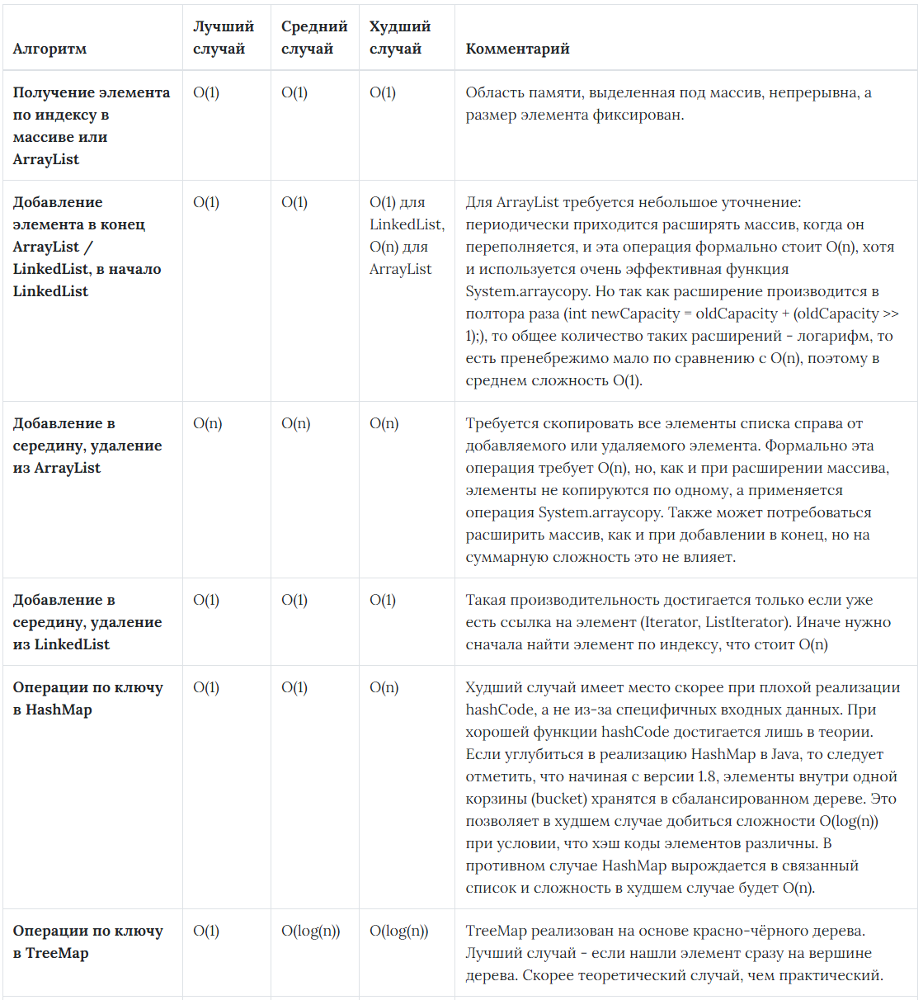

# Collections - Задание №1

### Посмотреть сложность и реализацию операций вставки и удаления в различных коллекциях<br/><br/>

### ArrayList
ArrayList представляет собой динамический массив. По мере добавления элементов емкость внутреннего массива автоматически увеличивается.

* Использует под капотом обычный массив `elementData`
* Быстрый доступ к элементам по индексу за константное время `O(1)`
* Быстрая вставка и удаление элементов с конца за константное время `O(1)`
* Доступ к элементам по значению за линейное время `O(n)`
* Медленная вставка и удаление элементов из середины `O(n)`
* Хранит любые значения, в том числе и `null`
* Автоматически увеличивается, но не уменьшается

ArrayList создается с начальной емкостью `capacity` 10 ячеек. Переменная `size` хранит количество добавленных элементов и изначально равна 0. Это не емкость внутреннего массива – емкость массива недоступна.

Если добавить в ArrayList больше элементов, чем его `capacity` – неявно для пользователя произойдет вызов метода `grow()` и пересоздание внутреннего массива.

Алгоритм вставки элемента в конец:

* Проверяется, достаточно ли места в массиве для вставки нового элемента `ensureCapacity(size + 1)`, если места недостаточно, происходит расширение
* Добавляется элемент в конец (согласно значению `size`) массива

Алгоритм расширения внутреннего массива:

* Создается новый массив по формуле `(capacity * 3) / 2 + 1`
* Все элементы старого массива котируются в новый методом `System.arraycopy()`
* Новый массив присваивается внутренней переменной `elementData`. Старый массив объявляется мусором – на него больше нет ссылки

Алгоритм вставки элемента в середину массива:
* Проверяется, достаточно ли места в массиве для вставки нового элемента
* Подготавливается место для нового элемента с помощью `System.arraycopy(elementData, index, elementData, index + 1, size - index)`
* Перезаписывается значение у элемента с указанным индексом `elementData[index] = element`

В случаях, когда происходит вставка элемента по индексу и при этом в массиве нет свободных мест, то вызов `System.arraycopy()` случится дважды: первый в `ensureCapacity()`, второй в самом методе `add(index, value)`, что явно скажется на скорости всей операции добавления.

Удаление элемента по индексу:
* Определяется какое количество элементов надо скопировать `numMoved = size - index - 1`
* Копируются элементы, используя `System.arraycopy(elementData, index + 1, elementData, index, numMoved)`
* Уменьшается значение переменной `size` и очищается последний элемент `elementData[--size] = null`

При удалении по значению, в цикле просматриваются все элементы списка, до тех пор пока не будет найдено соответствие. Удален будет лишь первый найденный элемент.

### LinkedList

LinkedList использует для хранения двусвязный список, поэтому итератор поддерживает обход в обе стороны. 

Помимо интерфейса List реализует интерфейсы Dequeue и Queue, т.е. соединяет функциональность работы со списком и функциональность очереди.

* Каждый элемент содержит ссылки на предыдущий и следующий элементы

* Позволяет хранить повторяющиеся объекты, в том числе `null`

* Быстрая вставка и удаление первого, последнего и элемента из середины списка за константное время `O(1)`

* Долгое время поиска позиции элемента за линейное время `O(n)`

* Операции поиска элемента по значению выполняются за линейное время `O(n)`

Класс LinkedList содержит три поля:

```
transient int size = 0
transient Node<E> first
transient Node<E> last
```

Для установки ссылок на предыдущий и следующий элементы LinkedList использует объекты своего вложенного класса Node:

```
private static class Node<E> {
    E item;
    Node<E> next;
    Node<E> prev;

    Node(Node<E> prev, E element, Node<E> next) {
        this.item = element;
        this.next = next;
        this.prev = prev;
    }
}
```

При каждом добавлении объекта в список создается один новый узел, а также изменяются значения полей связанного списка `size`, `first`, `last`.

В случае с добавлением первого элемента создается узел, у которого предыдущий и следующий элементы отсутствуют, т.е. равны `null`, размер коллекции увеличивается на 1, а созданный узел устанавливается как первый и последний элемент коллекции.

При добавлении в конец еще одного элемента создается узел для нового элемента и устанавливается ссылка на существующий элемент коллекции как на предыдущий, а следующим элементом у созданного узла остается `null`. Также этот новый узел сохраняется в переменную связанного списка `last`.

У первого элемента ссылка `next` заменяется и первый элемент начинает ссылаться на второй элемент коллекции.

Добавление объекта в середину связанного списка:

* С помощью метода `node(index)` определяется узел, находящийся в данный момент под индексом, под который необходимо вставить новый узел
* Создается узел для нового элемента, устанавливаются ссылки на предыдущий и следующий узлы, ссылки ранее существующих узлов пока не изменены
* Последовательно заменяются ссылки: для элемента, следующего за новым элементом, заменяется ссылка на предыдущий элемент, ля предшествующего новому элементу заменяется ссылка на следующий элемент
* В последнюю очередь увеличивается размер списка

Удаление элемента по значению:

* Искомый объект сравнивается по порядку со всеми элементами, сохраненными в узлах списка, начиная с нулевого узла
* Когда найден узел, элемент которого равен искомому объекту, первым делом элемент сохраняется в отдельной переменной
* Переопределяются ссылки соседних узлов так, чтобы они указывали друг на друга
* Обнуляется значение узла, который содержит удаляемый объект, а также уменьшается размер коллекции

### HashMap

HashMap использует хэш-таблицу, в которой ключи отсортированы относительно значений их хэш-кодов. Bucket – это элемент (ячейка) внутреннего массива HashMap (по умолчанию 16 бакетов). Внутри каждого бакета хранятся узлы Nodes в LinkedList.

HashMap содержит следующие свойства:

* `transient Node <K, V> [] table` – внутренний массив типа Entry
* `transient int size` — размер, количество добавленных элементов
* `int capacity` – емкость, количество бакетов в хэш-таблице
* `final float loadFactor` – коэффициент загрузки, по умолчанию равен 0.75, показатель насколько хэш-таблица может быть заполнена до того, как ее `capacity` будет автоматически увеличена
* `int threshold` – количество элементов, при достижении которого, размер хэш-таблицы увеличится в два раза, рассчитывается как `capacity * loadFactor`
* `transient Set< Map.Entry< K,V>> entrySet` — содержит кешированный `entrySet()`, с помощью которого можно перебирать HashMap

Node имеет следующие поля:

* `final int hash` — хэш текущего элемента, получается в результате хэширования ключа
* `final K key` — ключ текущего элемента
* `V value` — значение текущего элемента
* `Node <K, V> next` — ссылка на следующий узел в пределах одной корзины

Алгоритм добавления элемента в HashMap:

* Высчитывается хэш ключа методом `static final int hash(Object key)`, который уже обращается к методу `hashCode()`, используется либо переопределенный метод, либо его реализация по умолчанию
* Определяется бакет (ячейка массива), в которую будет добавлен новый элемент, номер определяется по остатку от деления хэшкода на количество ячеек, в более новых версиях Java с помощью бинарного сдвига
* Создается объект `Node`
* Если бакет пустой - элемент просто добавляется
* Если бакет не пустой – элемент добавляется в LinkedList внутри бакета:
  * Ключ добавляемого элемента сравнивается с ключами в LinkedList по хэшкодам
  * Если хэшкоды неравны – переход к следующему элементу
  * Если хэшкоды равны – ключи дополнительно сравниваются по `equals()`
  * Если ключи равны по `equals()` – перезаписывается `value` найденного ключа
  * Если ключи не равны по `equals()` – переход к следующему элементу
* Если ключ не найден в LinkedList – элемент добавляется в конец списка

Алгоритм удаления по ключу в HashMap:

* Высчитывается хэш ключа
* Определяется бакет, из которого нужно удалить элемент
* Если в бакете только один объект, сравниваются хэши, ссылки и ключи по `equals()` (если хэши не равны), если нашлось совпадение, то удаляем ключ и возвращаем значение этого ключа
* Если в бакете больше одного элемента, проверяется каждый элемент в цикле до тех пор, пока не будет найден элемент или не будет достигнут конец списка
* Если элемент не был найден — возвращается `null`

### TreeMap
В TreeMap структура хранения данных представляет собой красно-черное сбалансированное дерево. По умолчанию TreeMap сортируется по ключам с использованием принципа натуральной сортировки, но это поведение может быть настроено под конкретную задачу при помощи объекта класса `Comparator`.

Во время вставки, сначала находится место для нового элемента в дереве, затем вставляется новый элемент в соответствующее место, при этом сохраняя свойства красно-черного дерева. Если при вставке нарушается баланс дерева, то происходит перебалансировка дерева путем выполнения поворотов и изменения цветов узлов.

### Сложности операций в различных коллекциях  
