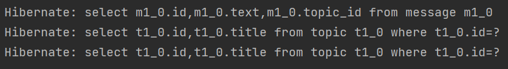
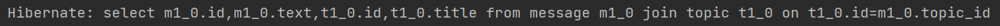
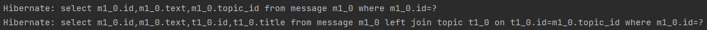

# Hibernate - Задание №1

### Рассмотреть решения проблемы N+1  

N+1 проблема в Hibernate состоит в том, в некоторых ситуациях один 
HQL select преобразуется N+1 SQL select-ов. Это отрицательно влияет 
на производительность, поэтому такого поведения нужно избегать.

В рассматриваемом примере заданы две сущности: `Topic` (топик) и `Message` 
(сообщение), каждое из которых относится к какому-то топику, то есть 
получаем отношение `ManyToOne`.

Если в сущности `Message` для поля `topic` не указать стратегию явно, 
то подразумевается стратегия `FetchType.EAGER`. Эта стратегия считается 
стратегией по умолчанию для всех полей, аннотированных `@ManyToOne`. 
Это означает, что при выборе комментариев Hibernate будет заполнять 
значением поле `topic`. Для этого он выполнит дополнительный select 
для каждого комментария, а это значит, что возникнет N+1 проблема.

Для демонстрации N+1 проблемы заполним базу двумя топиками с двумя 
сообщениями (по одному на каждый), а затем выполним select для сообщений.

В консоли получим:  

То есть был написан один select, а на деле их выполняется 3. 
Происходит так потому, что для каждого сообщения (а их выбралось 2 
в первом select-е) Hibernate выполняет дополнительный select для заполнения поля `topic`.

Если сменить для поля `topic` сущности `Message` стратегию извлечения, 
то есть поставить `FetchType.LAZY` (ленивое извлечение), то сразу после 
выполнения запроса поле `topic` не заполняется и соответствующий select
не выполняется, то есть сразу N+1 проблемы не возникнет. Однако, когда 
значение поля `topic` понадобится, Hibernate все равно сделает дополнительный select.

Проблему N+1 можно устранить с помощью `join fetch`, то есть для выбора 
сообщений пишется не простой select, а select с `join fetch`, который 
преобразуется в SQL с `inner join`.

В консоли будет один SQL-запрос:  

С помощью `Entity Graph` можно задать для каждого запроса свою стратегию 
загрузки данных: `LAZY` либо `EAGER`. Для сущности `Message` описано два графа:
`message-only-entity-graph` не выбирает атрибут `topic`, в то время как 
второй граф `message-topic-entity-graph` указывает ORM выбирать этот атрибут. 

В консоли будут выведены SQL-запросы для каждого графа:
