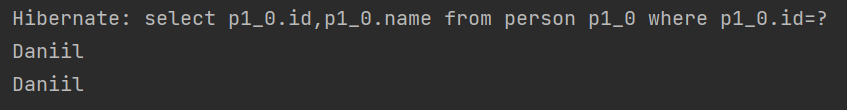

# Hibernate - Задание №2

### Посмотреть уровни кэширования<br/><br/>

В Hibernate существует три уровня кэширования:

1. Сессионный или транзакционный кэш, он же кэш первого уровня;
2. Кэш второго уровня или кэш SessionFactory;
3. Кэш запросов или кэш третьего уровня.

Кеш первого уровня всегда привязан к объекту сессии. Hibernate всегда 
по умолчанию использует этот кеш и его нельзя отключить. 

Пусть задана сущность `Person` с полем `name`.

### Кэш первого уровня

Попробуем получить сущность `Person` с одним и тем же идентификатором в рамках сессии два раза, при этом будет 
выполнен только один запрос, несмотря на то, что делается 2 вызова `getReference()`, 
так как эти вызовы происходят в контексте одной сессии. Во время второй попытки 
загрузить план с тем же идентификатором будет использован кэш сессии.



При использовании метода `getReference()` Hibernate не выгружает из БД 
данные до тех пор, пока они не потребуются. В момент, когда осуществляется
первый вызов `getReference()`, получаем прокси объект или сами данные 
в случае, если данные уже были в кэше сессии. Поэтому в коде присутствует
`getName()`, чтобы точно подтянуть данные из БД.

### Кэш второго уровня
Кэш второго уровня привязан к объекту-фабрике сессий (Session Factory object), 
а значит видимость этого кэша гораздо шире кэша первого уровня.

По умолчанию кэш второго уровня отключен. Для включения необходимо добавить 
следующие строки в конфигурационный файл `hibernate.cfg.xml`:
```xml
<session-factory>
    <property name="hibernate.cache.region.factory_class">org.hibernate.cache.ehcache.SingletonEhCacheRegionFactory</property>
    <property name="hibernate.cache.use_second_level_cache">true</property>
    <property name="net.sf.ehcache.configurationResourceName">/ehcache.xml</property>
</session-factory>
```

Также необходимо отдельно настроить реализацию кеша, в случае с EHCache это необходимо 
сделать в файле `ehcache.xml`:
```xml
<ehcache>
    <cache name="ru.tkachev.tinkoff_review.hibernate.task2.Person"
           maxEntriesLocalHeap="1000" eternal="false" timeToIdleSeconds="300" timeToLiveSeconds="600"/>
</ehcache>
```

Также нужно указать самому Hibernate, что именно кешировать, с помощью аннотации `@Cache`. 
Только после этих действий кэш второго уровня будет включен и в рассматриваемом примере будет 
выполнен только 1 запрос в базу.

### Кэш третьего уровня
Если получать сущности из базы через SQL, то результаты запросов не сохраняются 
ни кэшом первого, ни второго уровня. Это как раз то место, где можно использовать 
кэш запросов, который также по умолчанию отключен. Для включения нужно добавить 
следующую строку в конфигурационный файл: 
```xml
<session-factory>
    <property name="hibernate.cache.use_query_cache">true</property>
</session-factory>
```