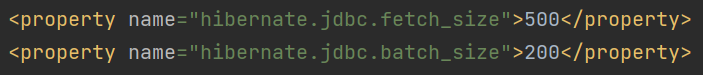

# Hibernate - Задание №4

### Настройка fetchSize, batchSize  

Оба этих параметра задают свойства в драйвере JDBC:

* `hibernate.jdbc.fetch_size` устанавливает размер выборки оператора в драйвере JDBC, 
то есть количество строк, которые извлекаются, когда в операторах `select` получается более одной строки;

* `hibernate.jdbc.batch_size` определяет количество обновлений (вставок, обновлений 
и удалений), которые отправляются в базу данных за один раз для выполнения, этот 
параметр необходим для выполнения пакетных вставок, но должен быть связан с параметром 
`ordered inserts` и возможностью драйвера JDBC перезаписывать вставки в инструкцию `batch insert`.

Оба параметра задаются в конфигурационном файле `hibernate.cfg.xml`:  
