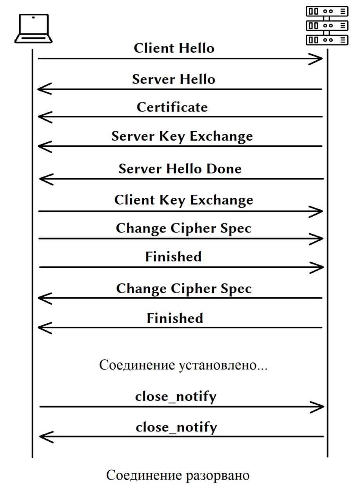

# Security - Задание №1

### Симметричное и ассиметричное шифрование, SSL  

Проблема протокола HTTP в том, что данные передаются по сети в открытом незашифрованном
виде. Это позволяет злоумышленнику слушать передаваемые пакеты и извлекать любую 
информацию из параметров, заголовков и тела сообщения. Для устранения уязвимости был 
разработан HTTPS (S в конце значит Secure) - он, хоть не является отдельным протоколом,
всего лишь HTTP поверх SSL (а позже TLS), позволяет безопасно обмениваться данными. 
В отличие от HTTP со стандартным TCP/IP портом 80, для HTTPS используется порт 443.

Secure Sockets Layer (SSL) - это криптографический протокол, обеспечивающий 
безопасное общение пользователя и сервера по небезопасной сети. Располагается между 
транспортным уровнем и уровнем программы-клиента (FTP, HTTP и т.п.). Впервые был 
представлен публике в 1995 году, однако с 2015 года признан полностью устаревшим. 
На основе спецификации SSL 3.0 в 1996 был разработан TLS 1.0.

Transport Layer Security (TLS) - это развитие идей, заложенных в протоколе SSL. 
На данный момент актуальной является версия TLSv1.2, с августа 2018 активно вводится 
TLSv1.3, тогда как TLSv1.1, TLSv1.0, SSLv3.0, SSLv2.0, SSLv1.0 находятся в статусе 
deprecated. Протокол обеспечивает: приватность (сокрытие передаваемой информации), 
целостность (обнаружение изменений), аутентификацию (проверка авторства). 
Достигаются они за счет гибридного шифрования, то есть совместного использования 
ассиметричного и симметричного шифрования.

Симметричное шифрование предполагает наличие общего ключа одновременно у отправителя 
и получателя, с помощью которого происходит шифровка и дешифровка данных. Данный тип 
не требователен к ресурсам, однако существенно страдает безопасность из-за опасности 
кражи ключа злоумышленником.

При использовании ассиметричного шифрования существует открытый ключ, который можно свободно распространять, и закрытый ключ, который держится в секрете у одной из сторон. Этот тип работает медленно, относительно симметричного шифрования, однако скомпрометировать закрытый ключ сложнее.

Чтобы решить проблему производительности (шифровать ассиметрично абсолютно все - 
сложно), в TLS используется гибридное шифрование: общий ключ для симметричного 
шифрования данных передается от клиента серверу зашифрованным открытым ключом 
сервера, после этого сервер может его расшифровать своим закрытым ключом и 
использовать для обмена данными с клиентом. Давайте разберем подробнее и по порядку,
каким образом работает TLS соединение.  

1. Client Hello - клиент начинает общение с сервером отсылая информацию о 
предпочитаемой версии протокола TLS, набора поддерживаемых шифров (Cipher Spec), 
и случайного простого числа (Client Random), необходимого в дальнейшем для генерации 
общего ключа симметричного шифрования.
2. Server Hello - сервер отвечает выбранной версией протокола и выбранным 
из предложенного набора шифром, которые будут непосредственно использоваться, 
своим случайным простым числом (Server Random) и идентификатором сессии.
3. Certificate - сервер отправляет свой сертификат, а клиент производит проверку 
подписи удостоверяющего центра, проверку доверия к удостоверяющему центру, 
проверку указанного домена сайта с фактическим, срока действия, проверяет не был 
ли сертификат отозван.
4. Server Key Exchange - этот этап происходит не всегда, только если необходимы 
дополнительные данные для создания симметричного ключа при выбранном алгоритме.
Например, при обмене ключами RSA этот шаг пропускается, и для обмена общим ключ 
передается от клиента серверу зашифрованным открытым ключом сервера из его сертификата. 
А для более надежного алгоритма Диффи-Хеллмана на этом этапе сервер отправляет 
рассчитанные по формуле числа p (большое простое число), g (может быть маленьким) и Ys.
5. Server Hello Done - сервер сообщает, что начальный этап установки соединения завершен.
6. Client Key Exchange - как было уже сказано выше, когда сервер передал числа p, g, Ys в Server Key Exchange, 
клиент передает свое число Yc в Client Key Exchange. Вычисленное в конце общее 
одинаковое число используется для создания pre-master secret - предварительного 
разделяемого ключа. На основании Client Random, Server Random и pre-master secret 
псевдослучайная функция выдает симметричный ключ и ключ вычисления MAC. 
Таким образом клиент и сервер имеют все необходимое для начала обмена полезной информацией.
7. Change Cipher Spec - клиент говорит серверу, что он готов перейти на защищенное соединение.
8. Finished - клиент зашифровывает симметричным ключом первое сообщение с MAC.
9. Change Cipher Spec - сервер проверяет сообщение Finished от клиента и отправляет в ответ свою готовность к защищенному соединению.
10. Finished - аналогично клиенту, сервер отправляет тестовое зашифрованное сообщение.
11. После этого соединение считается установленным, и происходит передача полезной информации.
12. Close_notify - служебное сообщение, которое одна сторона отправляет другой, 
как уведомление о том, что считает соединение разорванным и не будет принимать 
больше сообщения. Другая сторона в ответ обязана послать аналогичное сообщение Close_notify.
