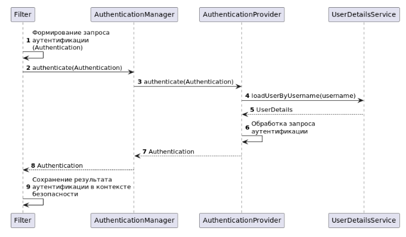

# Security - Задание №2

### Аутентификация, авторизация, идентификация<br/><br/>

Процесс предоставления пользователю доступа к информационной системе состоит из трёх 
этапов: идентификации, аутентификации и авторизации.

Идентификация — поиск пользователя по некоторому идентификатору, который он передаёт 
системе. В качестве идентификатора может выступать логин, адрес электронной почты, 
номер телефона, в общем, любая информация, позволяющая однозначно идентифицировать 
пользователя в рамках системы.

После того как пользователь идентифицирован, его требуется аутентифицировать 
или подтвердить его подлинность. Для подтверждения своей подлинности пользователь 
должен передать системе некоторую секретную информацию, которую в идеальных условиях
должен знать только он, а система в свою очередь должна иметь возможность проверить 
корректность секретной информации. В качестве секретной информации могут выступать:

* обычный пароль
* одноразовый пароль, сгенерированный по алгоритму HOTP или TOTP
* код, присланный в CMC
* последние цифры номера телефона, с которого поступит звонок

В общем, секретной информацией может выступать любая информация, которую на момент 
аутентификации должен знать только пользователь. Аутентификация при этом может быть 
многофакторной для повышения уровня безопасности и снижения вероятности получения 
несанкционированного доступа. Для этого у пользователя может требоваться несколько
видов секретной информации при аутентификации, например, пароль и одноразовый пароль,
сгенерированный по алгоритму TOTP в приложении Google Authenticator или аналогичном.

Со стороны пользователя идентификация и аутентификация являются одним процессом, 
так как данные для выполнения обоих действий — логин и пароль, пользователь 
отправляет одновременно, однако на стороне сервиса это два последовательных действия.

После того как пользователь идентифицирован и аутентифицирован, 
наступает этап авторизации — проверки наличия прав у пользователя к запрашиваемому 
ресурсу. Глобально существует два подхода к реализации авторизации: на основе аттрибутов
пользователя (Attribute Based Access Control; ABAC), например, ролей (Role Based 
Access Control; RBAC), и на основе списка правил доступа (Access Control List; ACL). 
ABAC является наиболее распространённым способом реализации авторизации 
в веб-приложениях, в основном благодаря простоте реализации, в то время как 
ACL применяется в более сложных проектах, как правило, корпоративного и 
государственного сегментов, так как позволяет более гибко настраивать политики доступа.

Основными компонентами Spring Security являются фильтры, и аутентификация 
не является исключением — отправной точкой процесса идентификации и аутентификации 
является соответствующий фильтр аутентификации. Так Basic-аутентификация 
инициируется фильтром `BasicAuthenticationFilter`, для упрощения процесса 
написания фильтров для обработки запросов Spring Security предоставляет 
абстрактные реализации, среди которых есть `OncePerRequestFilter`, 
ориентированный на работу с HTTP-запросами.

Первым делом фильтр должен определить, что пользователь пытается аутентифицироваться.
Сделать это он может по наличию данных, специфичных для конкретного способа 
аутентификации, например, какого-то заголовка или параметров запроса. 
Из полученных данных фильтр должен сформировать запрос аутентификации — 
создать экземпляр класса, реализующего интерфейс `Authentication`.

Созданный запрос аутентификации для дальнейшей обработки фильтр должен передать 
менеджеру аутентификации — `AuthenticationManager`. В целом при создании 
собственных фильтров аутентификации можно реализовывать весь процесс аутентификации 
в фильтре, не используя остальные компоненты, но в этом случае пропадает гибкость 
архитектуры Spring Security. В случае успешной аутентификации `AuthenticationManager` 
вернёт результат аутентификации, который тоже является экземпляром класса, 
реализующего интерфейс `Authentication`, но запрос и результат аутентификации — разные объекты.

Полученный результат аутентификации фильтр должен сохранить в новом контексте 
безопасности — `SecurityContext`, а после этого продолжить исполнение цепочки 
фильтров безопасности, вызвав метод `FilterChain.filter(request, response)`. 
Важно помнить, что менеджер аутентификации может вернуть только успешный результат 
аутентификации, а если по какой-то причине аутентифицировать пользователя 
не получилось — выбросить соответствующее исключение.

Если в процессе аутентификации произошла ошибка, то фильтр должен очистить контекст 
безопасности. Кроме этого в большинстве случаев фильтр должен снова запросить 
у пользователя данные для идентификации или аутентификации при помощи точки входа 
аутентификации — `AuthenticationEntryPoint`, после чего нужно приостановить 
обработку запроса. Обработка запроса приостанавливается, если отсутствует 
вызов метода `FilterChain.filter(request, response)`.

Если фильтр допускает продолжение обработки запроса даже при ошибке аутентификации, 
то он должен продолжить исполнение цепочки фильтров безопасности, 
вызвав метод `FilterChain.filter(request, response)`.

Если запрос не содержит данных для инициации процесса идентификации и аутентификации 
пользователя, то фильтр не должен ничего делать, а только продолжить исполнение
цепочки фильтров, вызвав метод `FilterChain.filter(request, response)`.

В общих чертах любой фильтр аутентификации выглядит следующим образом:

```java
class AuthFilter extends OncePerRequestFilter {

    private SecurityContextHolderStrategy secCtxHldStr;

    private SecurityContextRepository secCtxRep;

    private AuthenticationManager authMan;

    private AuthenticationEntryPoint authEntPt;

    private boolean ignoreFailure;

    public void doFilterInternal(HttpServletRequest req, HttpServletResponse resp, FilterChain chain) throws ServletException, IOException {
        // Создать запрос аутентификации
        var authReq = this.buildAuthReq(req);
        
        // Если запрос содержит данные аутентификации, то попытаться обработать их
        if (authReq != null) {
            try {
                // Попытаться аутентифицировать
                var authRes = this.authMan.authenticate(authReq);
                
                // Создать новый контекст безопасности
                var secCtx = this.secCtxHldStr.createEmptyContext();
                
                // Сохранить результат аутентификации в контексте безопасности
                secCtx.setAuthentication(authRes);
                
                // Сохранить контекст
                this.secCtxHldStr.setContext(secCtx);
                this.secCtxRep.saveContext(secCtx, req, resp);
            } catch (AuthenticationException e) {
                // В случае ошибки очистить контекст безопасности
                this.secCtxHldStr.clearContext();
                
                if (!this.ignoreFailure) {
                    // Если ошибки аутентификации не игнорируются,
                    // то запросить у пользователя данные для аутентификации
                    // при помощи точки входа
                    this.authEntPt.commence(req, resp, e);
                    
                    // И прервать обработку запроса
                    return;
                }
            }
        }

        // И продолжить обработку запроса
        chain.doFilter(req, resp);
    }
}
```

Схематично процесс аутентификации можно описать следующим образом:  




Запрос и результат аутентификации в Spring Security описывается одним и тем же 
интерфейсом — `Authentication`, однако запрос и результат — разные объекты, 
содержащие разные данные:

* Метод `getPrincipal()` у запроса возвращает идентификатор пользователя 
(логин в случае с аутентификацией по логину и паролю), а у результата может 
возвращать как идентификатор, так и объект с подробными данными успешно 
аутентифицированного пользователя, например, `UserDetails`.


* Метод `isAuthenticated()` возвращает false у запроса и true — 
у успешного результата.

Более того, в рамках одной попытки аутентификации запрос и результат могут 
быть экземплярами разных классов.

Интерфейс `Authentication` расширяет стандартный для JDK интерфейс `Principal`, 
добавляя методы, необходимые для работы Spring Security:

```java
public interface Authentication extends Principal, Serializable {

    /**
     * Метод для получения прав пользователя,
     * не может возвращать null,
     * может вернуть пустой список, если пользователь
     * не аутентифицирован
     */
    Collection<? extends GrantedAuthority> getAuthorities();

    /**
     * Секретная информация для подтверждения подлинности
     * пользователя, например, пароль.
     */
    Object getCredentials();

    /**
     * Дополнительная информация о запросе (ip, серийный номер
     * сертификата и т.д.), может быть null, если не используется
     */
    Object getDetails();

    /**
     * Идентификатор пользователя в запросе аутентификации или
     * объект с данными об аутентифицированном пользователе
     */
    Object getPrincipal();

    /**
     * Является ли пользователь аутентифицированным
     */
    boolean isAuthenticated();

    /**
     * Изменение состояние аутентификации, может принимать только false
     */
    void setAuthenticated(boolean isAuthenticated)
        throws IllegalArgumentException;

}
```

Для идентификации и аутентификации пользователей с использованием логина и пароля 
существует класс `UsernamePasswordAuthenticationToken`, расширяющий абстрактный 
класс `AbstractAuthenticationToken:`

```java
public abstract class AbstractAuthenticationToken implements Authentication, CredentialsContainer {

    private final Collection<GrantedAuthority> authorities;

    private Object details;

    private boolean authenticated = false;
}

public class UsernamePasswordAuthenticationToken extends AbstractAuthenticationToken {

    private final Object principal;

    private Object credentials;
}
```

Свойства `principal`, `credentials` и `details` имеют тип `Object`, это делает 
их универсальными, но в то же время подразумевает усложнение работы с ними, 
так как в процессе нужно будет проверять типы фактических значений этих свойств 
и приводить значения этих свойств к нужным типам.

Второй крупный компонент Spring Security, участвующий в процессе аутентификации 
пользователя — менеджер аутентификации, экземпляр класса, 
реализующего интерфейс `AuthenticationManager`.

```java
public interface AuthenticationManager {

    /**
     * Пытается обработать запрос аутентификации,
     * возвращает успешный результат аутентификации
     * или выбрасывает исключение
     */
    Authentication authenticate(Authentication authentication) throws AuthenticationException;
}
```

Задача данного компонента — обработать запрос на аутентификацию и вернуть 
успешный результат аутентификации, либо выбросить исключение. Впрочем, 
основная стандартная реализация этого интерфейса — `ProviderManager` не реализует 
процесс аутентификации, а делегирует большую его часть другим 
компонентам — провайдерам аутентификации, экземплярам классов, 
реализующих интерфейс `AuthenticationProvider`.

Провайдеры аутентификации описываются интерфейсом `AuthenticationProvider`:

```java
public interface AuthenticationProvider {

    /**
     * Пытается обработать запрос аутентификации,
     * возвращает успешный результат аутентификации
     * или null в случае попытки обработать не поддерживаемый запрос аутентификации
     * или выбрасывает исключение
     */
    Authentication authenticate(Authentication authentication)
        throws AuthenticationException;

    /**
     * Проверяет, может ли данный провайдер обработать
     * запрос аутентификации
     */
    boolean supports(Class<?> authentication);
}
```

В процессе обработки запроса аутентификации провайдер должен получить данные 
о пользователе из некоторого источника, будь то база данных, сторонний сервис 
или параметры JWT, провалидировать с их помощью данные запроса и из них же 
заполнить свойства `principal`, `credentials` и `authorities`.

Каждый провайдер поддерживает какой-то специфичный способ аутентификации, 
так `AbstractUserDetailsAuthenticationProvider` поддерживает только 
`UsernamePasswordAuthenticationToken`. В контексте безопасности приложения 
может быть сконфигурировано несколько провайдеров для поддержки разных способов 
аутентификации. Более того, контекст безопасности приложения может содержать 
несколько провайдеров, способных обработать один и тот же тип запроса аутентификации.
Это может быть полезно в случаях, когда провайдеры имеют разную логику обработки 
запроса аутентификации или источники данных о пользователях. В такой ситуации 
один провайдер может не аутентифицировать пользователя, а другой — успешно это сделать.

Для создания корректного результата аутентификации необходимы данные о пользователе. 
В Spring Security для описания пользователя существует интерфейс `UserDetails`:

```java
public interface UserDetails extends Serializable {

    /**
     * Список прав пользователя
     */
    Collection<? extends GrantedAuthority> getAuthorities();

    /**
     * Пароль пользователя
     */
    String getPassword();

    /**
     * Логин пользователя
     */
    String getUsername();

    /**
     * Срок действия учётной записи не истёк
     */
    boolean isAccountNonExpired();

    /**
     * Учётная запись не заблокирована
     */
    boolean isAccountNonLocked();

    /**
     * Срок действия пароля не истёк
     */
    boolean isCredentialsNonExpired();

    /**
     * Учётная запись активирована
     */
    boolean isEnabled();

}
```

Spring Security не взаимодействует с этим интерфейсом и его реализациями напрямую, 
следовательно, в качестве источника информации о пользователе может выступать 
любой класс или интерфейс. Единственное ограничение — класс или интерфейс, 
описывающий пользовательские данные, должен реализовывать или расширять 
интерфейс `Serializable`, так как пользовательские данные сериализуются при 
сохранении в HTTP-сессии.

Контекст безопасности описывается интерфейсом `SecurityContext` и используется 
для хранения успешной аутентификации:

```java
public interface SecurityContext extends Serializable {

    Authentication getAuthentication();

    void setAuthentication(Authentication authentication);
}
```

Для доступа к текущему контексту безопасности следует использовать экземпляры 
классов, реализующих интерфейс `SecurityContextHolderStrategy`, как это было 
показано в примере кода фильтра выше. Так же для сохранения контекста безопасности 
между запросами можно использовать репозитории контекстов безопасности — 
`SecurityContextRepository`, что также демонстрируется в примере кода фильтра.
