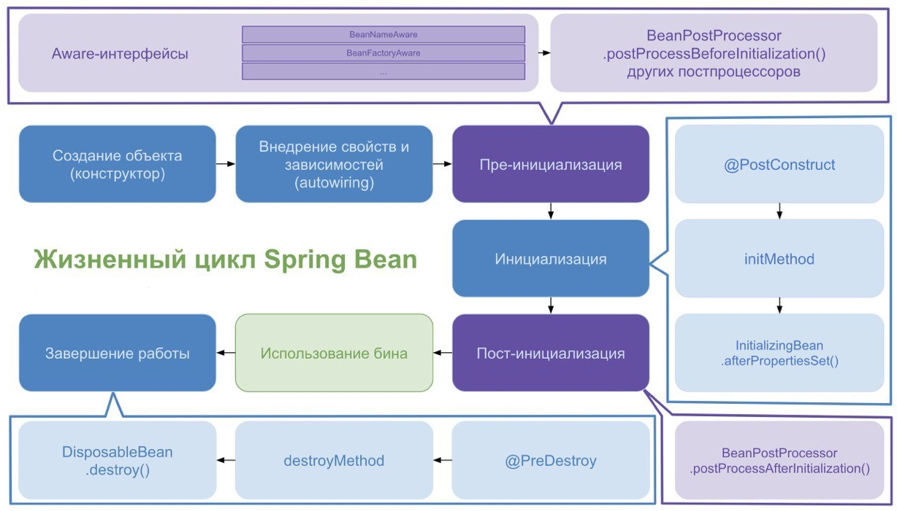

# Spring - Задание №1

### Посмотреть зачем нужны все стадии преинициализации бина  

Метод `postProcessBeforeInitialization()` в Spring является одним из методов 
интерфейса `BeanPostProcessor`, который вызывается перед инициализацией бина 
и позволяет изменить свойства бина или его состояние.

На этапе инициализации бина можно реализовать метод `afterPropertiesSet()` 
интерфейса `InitializingBean`. Данный метод позволяет выполнять 
какие-либо действия после инициализации всех свойств бина контейнером.

Однако метод `afterPropertiesSet()` не рекомендуется использовать, 
поскольку он дублирует код Spring. Более предпочтительно использовать
метод, помеченный аннотацией `@PostConstruct`. Данный метод должен быть 
вызван после создания и установки свойств бина, но перед тем, как бин будет использоваться в приложении.

Для методов инициализации порядок вызовы следующий:
* Методы с аннотациями `@PostConstruct` в порядке их определения в классе;
* Метод `afterPropertiesSet()`;
* Метод, указанный в параметре `initMethod` аннотации `@Bean`.

В рассматриваемом примере создан компонент `User`, который имеет
единственное поле `name`. Для установки имени используется метод
`postProcessBeforeInitialization()` класса `UserBeanPostProcessor`,
который реализует интерфейс `BeanPostProcessor`.

В компоненте `User` также определен метод, помеченный аннотацией
`@PostConstruct` и выводящий информацию о том, что компонент был 
проинициализирован с определенным именем. Компонент `User` также реализует интерфейс `InitializingBean`
и переопределяет метод `afterPropertiesSet()`, который 
выполняется после метода с аннотацией `@PostConstruct`.

Aware интерфейсы - это интерфейсы, которые позволяют компонентам и бинам  
получать доступ к контексту Spring. Например, если бин реализует 
интерфейс `ApplicationContextAware`, то он будет иметь доступ к контексту приложения.

Компонент `User` реализует интерфейс `ApplicationContextAware` и в методе
`setApplicationContext()` выводит список всех бинов в контексте.