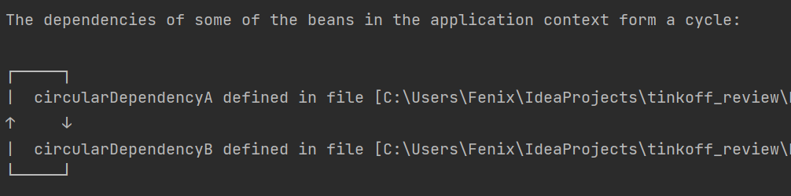

# Spring - Задание №2

### Посмотреть как решаются циклические зависимости в Spring  

Когда контекст Spring загружает все компоненты, он пытается создать компоненты 
в порядке, необходимом для их полной работы.

Циклические зависимости возникают, когда два или более компонента 
взаимно зависят друг от друга. Например, созданный компонент `CircularDependencyA` 
зависит от компонента `CircularDependencyB`, а созданный компонент `CircularDependencyB` 
зависит от компонента `CircularDependencyA`.

При циклической зависимости Spring не может решить, какой из 
компонентов следует создать первым, поскольку они зависят друг 
от друга. В этих случаях Spring вызовет исключение 
BeanCurrentlyInCreationException при загрузке контекста (см. рисунок ниже). 

Циклические зависимости могут возникнуть только при использовании 
инжекта бина через конструктор. Если использовать другие типы инжекта,
зависимости будут вводиться только тогда, когда они необходимы, а не при создании контекста.

Самый простой способ решения проблемы циклических зависимостей - 
указать Spring лениво инициализировать один из компонентов.
Когда компонент помечен аннотацией `@Lazy`, Spring создает прокси-объект, 
который будет использоваться вместо реального компонента до тех пор, 
пока он не будет запрошен. Когда компонент запрашивается, Spring 
создает реальный объект и передает ему управление.